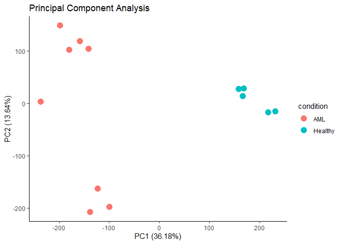
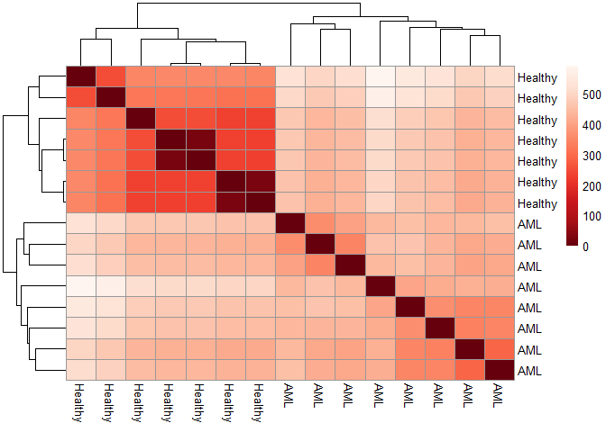
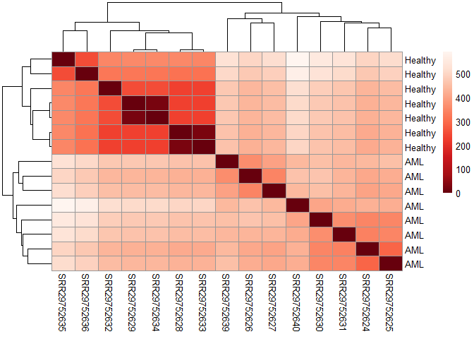

Exploring transcript data profile of healthy and AML patient samples
================

## Loading the required libraries

## Loading the data

Prepare the sample table of the experiment and load quant data generated
by Salmon into R

``` r
sample_table <- read_csv("../data/SRP518774_metadata.txt") %>%
  filter(`Assay Type` == "RNA-Seq") %>%
  select(`Run`, `isolate`) %>%
  mutate(condition = if_else(str_detect(isolate, "health"), "Control/Healthy", "AML Patient")) %>%
  select(`Run`, condition) %>%
  mutate(sample_name = Run) %>%
  select(sample_name, condition)

sample_table
```

    ## # A tibble: 15 × 2
    ##    sample_name condition      
    ##    <chr>       <chr>          
    ##  1 SRR29752624 AML Patient    
    ##  2 SRR29752625 AML Patient    
    ##  3 SRR29752626 AML Patient    
    ##  4 SRR29752627 AML Patient    
    ##  5 SRR29752628 Control/Healthy
    ##  6 SRR29752629 Control/Healthy
    ##  7 SRR29752630 AML Patient    
    ##  8 SRR29752631 AML Patient    
    ##  9 SRR29752632 Control/Healthy
    ## 10 SRR29752633 Control/Healthy
    ## 11 SRR29752634 Control/Healthy
    ## 12 SRR29752635 Control/Healthy
    ## 13 SRR29752636 Control/Healthy
    ## 14 SRR29752639 AML Patient    
    ## 15 SRR29752640 AML Patient

``` r
sample_files <- paste0(pull(sample_table, 
            sample_name), '_quant/quant.sf')

sample_files <- paste0("../data/quants/", sample_files)

#paste0(sample_files, '_quant/quant.sf')

gene_map <- read_csv('../data/gene_map.csv', 
                     col_names = c('enstid', 'ensgid'))

names(sample_files) <- pull(sample_table, sample_name)


count_data <- tximport(files = sample_files,
                       type = 'salmon', 
                       tx2gene = gene_map,
                       ignoreTxVersion = TRUE)

# peek out counts data (non-normalized) and trancript - gene map
count_data$counts %>% head(10)
```

    ##                 SRR29752624 SRR29752625 SRR29752626 SRR29752627 SRR29752628
    ## ENSG00000000003       5.000      43.000       4.000      17.942       0.000
    ## ENSG00000000005       0.000       0.000       0.000       0.000       0.000
    ## ENSG00000000419    1605.877    2098.224    1918.625     816.849    1337.820
    ## ENSG00000000457     436.374     783.064     453.732     375.294     786.117
    ## ENSG00000000460     546.859     266.987     743.241     344.709    1332.901
    ## ENSG00000000938     304.000     718.001      88.000     907.043       3.000
    ## ENSG00000000971      44.109     907.045      22.879      24.932      73.191
    ## ENSG00000001036    1806.763    1570.640     185.819     265.999     256.766
    ## ENSG00000001084    2084.829    1567.001    1137.615     497.963    1675.005
    ## ENSG00000001167    2648.343    1390.797    2777.145    2700.291    1198.091
    ##                 SRR29752629 SRR29752630 SRR29752631 SRR29752632 SRR29752633
    ## ENSG00000000003       1.000       6.000       0.000       7.000       0.000
    ## ENSG00000000005       0.000       0.000       0.000       0.000       0.000
    ## ENSG00000000419    1407.886    1169.312     955.761    1126.350    1350.816
    ## ENSG00000000457     984.356     402.995    1033.207     899.301     796.505
    ## ENSG00000000460    1068.660     374.004     456.165    1192.254    1347.512
    ## ENSG00000000938       9.000     111.000     834.596       6.000       3.000
    ## ENSG00000000971      23.277     107.318      48.586      61.088      74.187
    ## ENSG00000001036     274.106     890.621     732.070     366.000     260.768
    ## ENSG00000001084    1556.584     737.125     870.487    1538.001    1684.005
    ## ENSG00000001167    1310.492     575.000    1857.890    1103.020    1207.091
    ##                 SRR29752634 SRR29752635 SRR29752636 SRR29752639 SRR29752640
    ## ENSG00000000003       1.000       0.000       0.000       0.000      11.810
    ## ENSG00000000005       0.000       0.000       0.000       0.000       0.000
    ## ENSG00000000419    1417.907     938.286    1440.801    1131.193     767.020
    ## ENSG00000000457     992.718     485.424     584.304     968.619     365.834
    ## ENSG00000000460    1074.299    1178.591    1238.441    1097.535      92.395
    ## ENSG00000000938       9.000       0.000       1.000      14.000      56.000
    ## ENSG00000000971      23.273      13.000      41.178      55.146     198.545
    ## ENSG00000001036     276.081     423.002     409.000     207.000     200.042
    ## ENSG00000001084    1570.583    1229.990    1216.293     886.483     598.524
    ## ENSG00000001167    1330.497    1377.670    1245.068    2648.138    3095.852

``` r
gene_map %>% head(10)
```

    ## # A tibble: 10 × 2
    ##    enstid          ensgid         
    ##    <chr>           <chr>          
    ##  1 ENST00000832824 ENSG00000290825
    ##  2 ENST00000832825 ENSG00000290825
    ##  3 ENST00000832826 ENSG00000290825
    ##  4 ENST00000832827 ENSG00000290825
    ##  5 ENST00000832828 ENSG00000290825
    ##  6 ENST00000832829 ENSG00000290825
    ##  7 ENST00000832830 ENSG00000290825
    ##  8 ENST00000832837 ENSG00000290825
    ##  9 ENST00000832836 ENSG00000290825
    ## 10 ENST00000832832 ENSG00000290825

## Load the quant data and sample information into DESeq2 datatype

``` r
sample_table$condition <- factor((c('AML', 'AML', 'AML', 'AML', 'Healthy',
                                         'Healthy', 'AML', 'AML', 'Healthy', 'Healthy',
                                         'Healthy', 'Healthy', 'Healthy', 'AML', 'AML')),
                                      levels = c('AML', 'Healthy'))

dds_aml <- DESeqDataSetFromTximport(txi = count_data,
                                     colData = sample_table,
                                     design = ~condition)

# Normalization - median of ratios method TTM DESeq2
dds_aml <- estimateSizeFactors(dds_aml)
#normalizationFactors(dds_aml)
counts(dds_aml, normalized = T) %>% head(10)
```

    ##                 SRR29752624 SRR29752625 SRR29752626 SRR29752627 SRR29752628
    ## ENSG00000000003    4.061633    37.04658    2.734326    14.69694     0.00000
    ## ENSG00000000005    0.000000     0.00000    0.000000     0.00000     0.00000
    ## ENSG00000000419 1429.016673  1541.07835 1582.693384   610.59318  1589.17525
    ## ENSG00000000457  445.391534   577.18152  345.855612   285.20255   929.06306
    ## ENSG00000000460  617.156546   260.77690  685.675631   314.71122  1347.10597
    ## ENSG00000000938  269.398849   519.09992   52.870134   616.34266     5.82960
    ## ENSG00000000971   39.843160   615.38338   17.456311    22.42812    67.18923
    ## ENSG00000001036 1499.320639  1314.75566  152.378109   201.97780   262.02154
    ## ENSG00000001084 2045.274041  1283.81469  823.735455   345.35865  1914.70371
    ## ENSG00000001167 2647.463596  1150.84646 2096.829059  2043.78054  1438.39446
    ##                  SRR29752629 SRR29752630 SRR29752631 SRR29752632 SRR29752633
    ## ENSG00000000003    0.8659004    5.951684     0.00000    6.691777    0.000000
    ## ENSG00000000005    0.0000000    0.000000     0.00000    0.000000    0.000000
    ## ENSG00000000419 1451.7003191 1000.596963   972.04469 1316.856157 1586.408566
    ## ENSG00000000457 1023.7265292  355.763114  1046.23331 1074.202006  933.837721
    ## ENSG00000000460 1084.7423451  410.803587   407.70255 1265.529038 1342.829501
    ## ENSG00000000938    7.5415713  120.383692   766.48749   11.712666    5.762079
    ## ENSG00000000971   23.1644177  118.835571    47.72805   66.295932   66.858088
    ## ENSG00000001036  323.1784301  987.768124   686.43689  406.186255  268.108134
    ## ENSG00000001084 1330.4084624  857.750179   849.40562 1581.995146 1907.112556
    ## ENSG00000001167 1461.3309867  757.532924  1605.35545 1481.192267 1425.692316
    ##                  SRR29752634 SRR29752635 SRR29752636 SRR29752639 SRR29752640
    ## ENSG00000000003    0.8550343     0.00000    0.000000    0.000000    22.89134
    ## ENSG00000000005    0.0000000     0.00000    0.000000    0.000000     0.00000
    ## ENSG00000000419 1443.2360314  1488.50236 1961.280411 1128.052616   593.28003
    ## ENSG00000000457 1022.4666017   868.00185  842.945209  732.330690   271.10038
    ## ENSG00000000460 1077.7108204  1700.28666 1443.213953  751.964009    80.59336
    ## ENSG00000000938    7.4468845     0.00000    1.065936    9.667727    40.18392
    ## ENSG00000000971   22.8737582    20.62298   63.006766   52.263440   209.69572
    ## ENSG00000001036  320.1105869   599.81629  420.574754  210.929332   188.52182
    ## ENSG00000001084 1328.6769444  1992.59896 1201.731983 1000.299665   751.23824
    ## ENSG00000001167 1463.5578402  1967.63095 1278.424776 1665.580346  2668.22728

## Principal Component Analysis

``` r
# Transform the data so it is suitable for PCA
vst_aml <- varianceStabilizingTransformation(dds_aml)
# create matrix
vst_mat <- assay(vst_aml)

pca <- prcomp(t(vst_mat))

# plot out the data frame to produce PCA
df <- as.data.frame(pca$x)
df$condition <- sample_table$condition

pve <- round(pca$sdev^2/sum(pca$sdev^2) * 100, 2)

rownames_to_column(df, var = "sample_name") %>% as.tibble() %>%
  ggplot(., aes(x=PC1, y=PC2, color = condition)) +
  geom_point(size = 4) +
  #geom_text(aes(label = sample_name, color = condition), vjust = -1, size = 4) +
  xlab(label = paste0("PC1 (", pve[1], "%)")) +
  ylab(label = paste0("PC2 (", pve[2], "%)")) +
  theme_classic() +
  ggtitle("Principal Component Analysis")
```

<!-- -->

``` r
ggsave("../figures/PCA.png")
```

Looks like we have two dots that consist of two overlap healthy samples,
so that we only see five dots for healthy

## Heatmap

``` r
distance <- dist(t(assay(vst_aml)))
distance_matrix <- as.matrix(distance)
rownames(distance_matrix) <- vst_aml$condition
colnames(distance_matrix) <- vst_aml$condition
colors <- colorRampPalette( rev(brewer.pal(9, "Reds")) )(255)

pheatmap(distance_matrix,
         clustering_distance_rows=distance,
         clustering_distance_cols=distance,
         col=colors)
```

<!-- -->

``` r
ggsave("../figures/heatmap.png")


distance <- dist(t(assay(vst_aml)))
distance_matrix <- as.matrix(distance)
rownames(distance_matrix) <- vst_aml$condition
colnames(distance_matrix) <- vst_aml$sample_name
colors <- colorRampPalette( rev(brewer.pal(9, "Reds")) )(255)

pheatmap(distance_matrix,
         clustering_distance_rows=distance,
         clustering_distance_cols=distance,
         col=colors)
```

<!-- -->

comnfirmed with the heatmap, two dots consist of two samples that very
very similiar. Is that come from same person but different processed
samples (technical replicates)?
